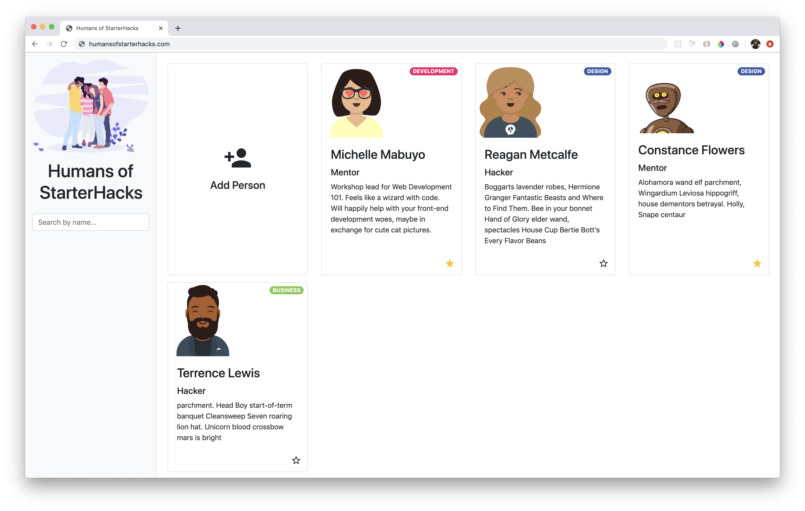

# Humans of StarterHacks

Hello! These are the project instructions for [StarterHacks 2020](https://starterhacks.ca/) Web Development 101 Workshop.

We're building a website called Humans of StarterHacks, where you can keep track of the people you meet during the hackathon.

## [Demo the website](https://mabuyo.github.io/humans-of-starterhacks/)

_Add gif_

## Technologies

- HTML
- CSS
- [Bootstrap](https://getbootstrap.com/)
- [Material Icons](https://material.io/resources/icons/)
- Javascript
- [Handlebars](https://handlebarsjs.com/)
- [Airtable](https://airtable.com/) Database & API

First, we use HTML, CSS and Bootstrap create a simple static website. Then, we augment it with some Javascript for interactivity. We use Handlebars as a templating language. Finally, we use Airtable as our database and API to save and update our data.

This project should give you a good starting point to hack together your StarterHacks project in a weekend!

## Pre-workshop Setup

1. Download a text editor like [VS Code](https://code.visualstudio.com/), [Atom](https://atom.io/) or [Sublime](https://www.sublimetext.com/). I'll be using VS Code.

1. Download [Prettier](https://prettier.io/docs/en/editors.html) for your text editor so that it can auto-format your code on save. You don't need to worry about fixing indentations on nesting!

## How to use these files

This project is split up into steps. Each step has its own folder for the code for each step and instructions. If you get lost during the workshop code-alongs, you can take a look at the relevant folder.

Feel free to also use the code as a jumping off point for your own project!

## Links

- [Bootstrap](https://getbootstrap.com/docs/4.4/getting-started/introduction/) for a front-end component library
- [undraw.co](https://undraw.co/) for illustrations
- [css.cool](css.cool) for CSS styles
- [Bootstrap Starter Templates](https://startbootstrap.com/templates/) for quick page layouts
- [CSS Tricks - Flexbox](https://css-tricks.com/snippets/css/a-guide-to-flexbox/) as a cheat sheet for how flexbox works
- [Flex Zombies - Game](https://mastery.games/p/flexbox-zombies) as a fun way to learn flexbox
- [Bootstrap - Card Component](https://getbootstrap.com/docs/4.4/components/card/)
- [Avataaars](https://getavataaars.com/) for an avatar representation
- [Badge Bootstrap Component](https://getbootstrap.com/docs/4.4/components/badge/)
- [Material Icons](https://material.io/resources/icons/)
- [Bootstrap - Grid Cards Layout](https://getbootstrap.com/docs/4.4/components/card/#grid-cards)
- [Bootstrap - Utilities (Spacing)](https://getbootstrap.com/docs/4.4/utilities/spacing/)
- [Robohash.org](https://robohash.org/) for placeholder avatars
- [Handlebars](https://handlebarsjs.com/) Installation - ``
