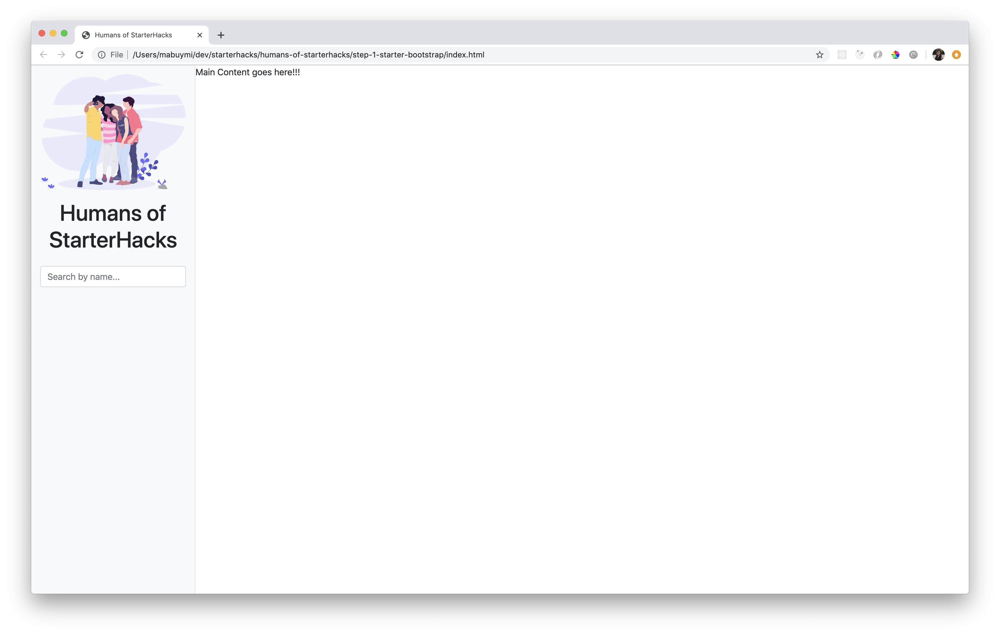

# Step 1:

## Goal



Create the HTML content for sidebar with website title, image and search input. Use CSS to set up the page layout.

## Steps

### Bootstrap Getting Started

1. Create a folder for your project (e.g. `humans-of-starterhacks`)
1. Create a file called `index.html`.
1. Go to the [Getting Started](https://getbootstrap.com/docs/4.4/getting-started/introduction/) section on the Bootstrap website. Copy the starter template code and paste it into `index.html`.
1. Open up the `index.html` file on your Google Chrome browser to see a sample Hello World website.

### Adding a title

1. The web browser tab title should say "Humans of StarterHacks".

   > Replace `<title>Hello World</title>` with the website title `<title>Humans of StarterHacks</title>`.

1. Add the title content to the page.

   > Replace `<h1>Hello World</h1>` with the website title `<h1>Humans of StarterHacks</h1>`.

### Adding an image

1. Find an image. Check out [undraw.co](https://undraw.co/) for illustration examples.

1. Create an `img` folder. Save the illustration you found in the previous step and save to the `img` folder. Give it the name `sidebar-logo.svg` or `sidebar-logo.png` depending on the file exstension.

1. Use the `` HTML tag to add the image to your website. ([Documentation](https://www.w3schools.com/tags/tag_img.asp))

   ```html
   
   ```

### Adding a search input

1. Use the `<input>` HTML tag to add a search box. ([Documentation](https://www.w3schools.com/tags/tag_input.asp))

   ```html
   <input type="text" placeholder="Search by name..." />
   ```

### Page layout

Let's use [Bootstrap's Layout system](https://getbootstrap.com/docs/4.4/layout/overview/) to craft the page layout with the sidebar and main contents.

We want the sidebar to be fixed on the left while the main contents on the right are scrollable.

There are many ways to get the layout we want! We're going to use a CSS stylesheet and flex. Alternatively, you can download the [Bootstrap Template for Simple Sidebar](https://startbootstrap.com/templates/simple-sidebar/). Copy paste the CSS file into your project and grab the HTML you need.

1. Use a `div` to group the 3 elements (`img`, `h1` and `input`) together and give it a class of `sidebar`

   ```html
   <div class="sidebar">
     
     <h1>...</h1>
     <input ... />
   </div>
   ```

1. Create another `div` container for the main content, below the sidebar `div`.

   ```html
   <div class="main-content">
     Main Content goes here
   </div>
   ```

1. Wrap the sidebar and main content `div`s within a parent `div` container and give it a class of `page-container`.

   ```html
   <div class="page-container">
     <div class="sidebar">
       
       <h1>...</h1>
       <input ... />
     </div>
     <div class="main-content">
       Main Content goes here
     </div>
   </div>
   ```

1. Create a file called `styles.css`.

1. Link your HTML to that stylesheet by adding this line within your `<head>`, after the Bootstrap CSS import.

   ```html
   <link rel="stylesheet" href="styles.css" />
   ```

1. Let's style our page with CSS! Go to your `styles.css` file and add the following (comments added for explanation).

   ```css
   body {
     height: 100vh;
   }

   .page-container {
     display: flex;
     height: 100%;
   }

   .sidebar {
     /* for layout */
     width: 350px;
     height: 100%;
     overflow: hidden;

     /* for styling */
     padding: 1em;
     text-align: center;
     border-right: 1px solid #dee2e6;
     background-color: #f8f9fa;
   }

   .main-content {
     width: 100%;
     height: 100%;
     overflow: auto;
   }
   ```

### Bootstrap Component: input

1. Let's use the the styles for the `input` Bootstrap component. Add the class `form-control` to the search field.

   ```html
   <input type="text" placeholder="Search by name..." class="form-control" />
   ```

### Spacing

The image, heading and search box look really close together. Let's add some spacing! We can do this through CSS as well, but let's try [Bootstrap's Utilities for Spacing](https://getbootstrap.com/docs/4.4/utilities/spacing/).

1. Add `p-3` (padding with size 3) to the `h1` title.

   ```html
   <h1 class="p-3">Humans of StarterHacks</h1>
   ```

   This is an example of a utility class. Instead of giving the `h1` a classname and coding the styles in the CSS file, we use a Bootstrap-provided utility class that achieves the same thing.
