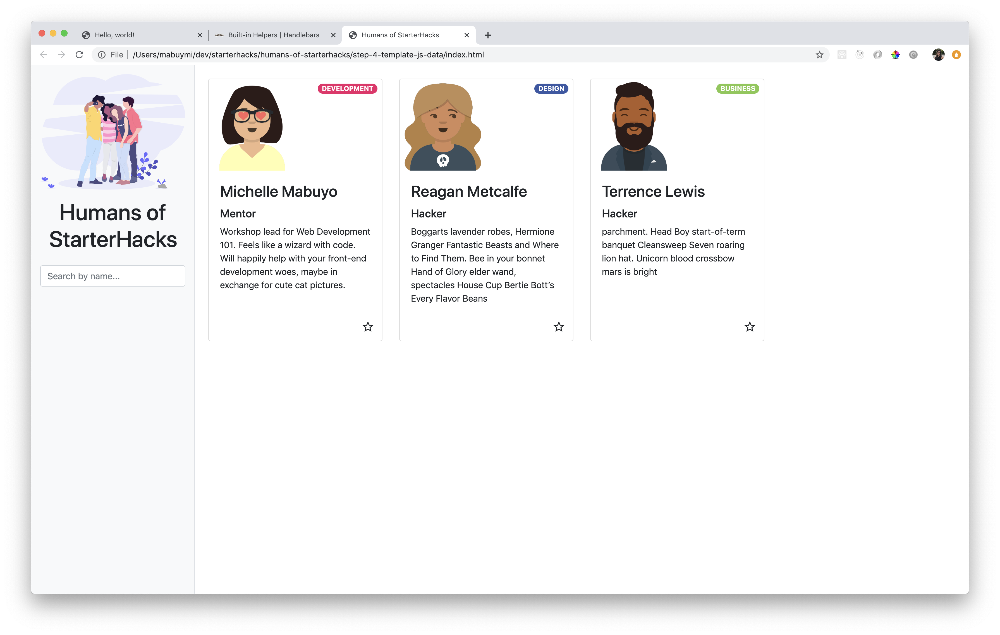

# Step 4: Template & Javascript Data

## Goal



Use Handlebars.js to create a template for the Card component. Use Javascript for mock data.

## Steps

### Create mock data in Javascript

1. Create an `index.js` file and link this in your HTML just before the closing `</body>` tag.

   ```html
   <script src="index.js"></script>
   ```

1. In your `index.js` file, create a variable called `peopleData`. This will be an array of objects, where each object is a person. A person has an id, name, role, stream, description, image_link and is_favourite boolean flag. Add at least 3 people!

   You can use [robohash.org](https://robohash.org/) for placeholder avatars as your image_link.

   Increment the id by 1 as you add more people.

   Keep the role and stream lowercase, we will style with capitalization in the code later.

   ```js
   let peopleData = [
     {
       id: 1,
       name: "Michelle Mabuyo",
       role: "mentor",
       stream: "development",
       description:
         "Workshop lead for Web Development 101. Feels like a wizard with code. Will happily help with your front-end development woes, maybe in exchange for cute cat pictures.",
       image_link: "img/michelle.png",
       is_favourite: true
     },
     {...},
     {...}
   ]
   ```

### Handlebars Setup

We're going to use Handlebars as a templating language to generate our HTML for each card component that we built last step.

1. Include Handlebars from a CDN link as a script just before the `index.js` import before the closing `</body>` tag.

   ```html
     <script src="https://cdn.jsdelivr.net/npm/handlebars@latest/dist/handlebars.js"></script>

     <script src="index.js"></script>
     </body>
   ```

1.

### Converting into a template

This article goes over a quick overview of how to learn Handlebars: https://tutorialzine.com/2015/01/learn-handlebars-in-10-minutes

We want to change all the hardcoded values in our card to variables for the template so it can be reused.

1. The Handlebars template will be contained in a `<script>` tag just after the opening `<body>` tag. Cut and paste the code for the Card component inside.

   ```html
   <body>
     <script id="card-template" type="text/x-handlebars-template">
       <div class="col mb-3">
         <div class="card h-100">
           ...
         </div>
       </div>
     </script>
     ...
   </body>
   ```

1. Where the Card component used to be, replace it with a `div` with id `target`. This is where we'll inject the contents of the Card with dynamic information.

1. Replace the template's hardcoded information with variables. Variables are contained in double brackets like so `{{variable}}`. Replace the name, role (the text and the `badge-` CSS class), stream, description, image_link.

   ```html
   <div class="col mb-3">
     <div class="card h-100">
       <div>
         
         <span
           class="badge badge-pill badge-{{stream}} float-right mt-2 mr-2 text-uppercase"
           >{{stream}}</span
         >
       </div>
       <div class="card-body">
         <h3 class="card-title">{{name}}</h3>
         <h5>{{role}}</h5>
         <p class="card-text">
           {{description}}
         </p>
       </div>
       <div class="text-right">
         <button class="btn fave-btn">
           <i class="material-icons">
             star_border
           </i>
         </button>
       </div>
     </div>
   </div>
   ```

1. Let's use Javascript and Handlebars to use the template and inject it into our website. In your `index.js` file, add the following snippet below (comments added for explanation):

   ```js
   // grab the source template from the HTML
   var source = document.getElementById("card-template").innerHTML;

   // use Handlebars to compile the template
   var template = Handlebars.compile(source);

   // grab the context (data) from the mock data in the first step. we'll use the first person in the array for now.
   var context = peopleData[0];

   // apply the context / data to the template
   var html = template(context);

   // inject the html with the data we want into our target `div` container
   document.getElementById("target").innerHTML = html;
   ```

1. To keep our code clean, put the code from the previous step in a function called `replaceHTMLCardTemplate`. Call it after it's declared.

   ```js
   const replaceHTMLCardTemplate = () => {
     var source = document.getElementById("card-template").innerHTML;
     var template = Handlebars.compile(source);
     var context = peopleData[0];
     var html = template(context);
     document.getElementById("target").innerHTML = html;
   };

   replaceHTMLCardTemplate();
   ```

### Creating multiple cards with the template

Time to make use of the template with multiple cards using the Handlebars `#each` helper.

1. We need to tweak our template to display multiple cards. Cut and paste the `div` container for all cards up to the `script` template.

   ```html
   <script id="card-template" type="text/x-handlebars-template">
      <div class="row row-cols-sm-2 row-cols-md-3 row-cols-lg-4">
       <div class="col mb-3">
         ...
       </div>
     </div>
   </script>
   ...
   <!-- below should look like: -->
   <div class="main-content pl-4 pr-4">
     <div id="target" />
   </div>
   ```

1. Wrap the card component in the template in a Handlebars `#each` block.

   ```html
   <script id="card-template" type="text/x-handlebars-template">
     <div class="row row-cols-sm-2 row-cols-md-3 row-cols-lg-4">
       {{#each people}}
         <div class="col mb-3">
           ...
           </div>
       {{/each}}
     </div>
   </script>
   ```

1. In your `index.js` file, change the context to be an array of people. Context takes in an object with keys and values. In our template, we are expecting a key for `people` set to an array of objects with information such as name, role, stream, etc, aka our `peopleData` variable.

   ```js
   const replaceHTMLCardTemplate = () => {
     var source = document.getElementById("card-template").innerHTML;
     var template = Handlebars.compile(source);
     var context = { people: peopleData };
     var html = template(context);
     document.getElementById("target").innerHTML = html;
   };
   ```

   You should see information from your array now!

### Quick styling fixes

1. Since the data is in lowercase for rolee, let's capitalize the text by adding `text-capitalize`.

   ```html
   <h5 class="text-capitalize">{{role}}</h5>
   ```

1. Add padding to the top of the main content so the cards aren't flush up with the top border.

   ```html
   <div class="main-content pl-4 pr-4 pt-4">
     ...
   </div>
   ```
