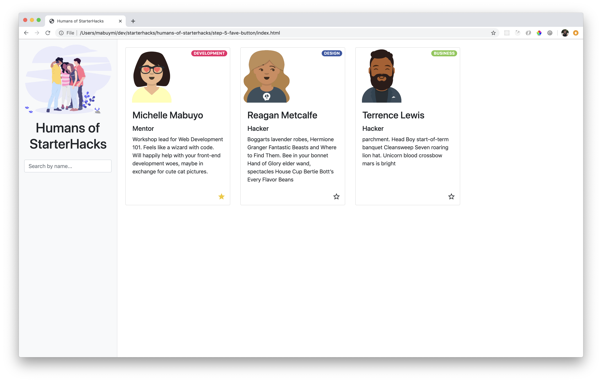

# Step 5: Fave Button

## Goal



Add a button to fave a person.

## Steps

### Add an event listener to the fave button

1. Create a function called `initializeFaveBtnClickListeners`. Call it after it's defined.

   ```js
   function initializeFaveBtnClickListeners() {}

   initializeFaveBtnClickListeners();
   ```

1. Get all of the fave buttons by class name.

   ```js
   function initializeFaveBtnClickListeners() {
     let faveBtns = document.getElementsByClassName('fave-btn');
   }
   ```

1. Iterate through the buttons and add a click listener.

   ```js
   function initializeFaveBtnClickListeners() {
     let faveBtns = document.getElementsByClassName('fave-btn');
     Array.from(faveBtns).forEach(btn => {
       btn.addEventListener('click', function() {
         // do something
       });
     });
   }
   ```

1. We need to get the id of the person that was clicked so we can update their `is_favourite` flag. To do this, give a `data-pid` attribute to the HTML element. Access that through the `dataset` attribute in JS.

   ```html
   <button class="btn fave-btn fave-btn--solid" data-pid="{{id}}">
     <i class="material-icons">star_border </i>
   </button>
   ```

   ```js
   btn.addEventListener('click', function() {
     let id = parseInt(btn.dataset.pid);
   });
   ```

1. Set up a separate function for toggling the `is_favourite` flag for the person and call it with the id grabbed from the previous step.

   ```js
   function toggleIsFavourite(id) {
    console.log("is_favourite button clicked for: " + id);

    // find the person we want to update in our array by using the id
    let person = people.find(function(person) {
      return person.id === id;
    });

    // update that person's is_favourite property (toggle it)
    person.is_favourite = !person.is_favourite;
   }

   ...

   btn.addEventListener("click", function() {
     const id = parseInt(btn.dataset.pid);

     toggleIsFavourite(id);
     replaceHTMLCardTemplate();
   });
   ```

1. Test it! You'll notice that the button click only works the first time.

1. Since the `replaceHTMLCardTemplate` function replaces the HTML in your website with new code, the event listeners that were set up beforehand are no longer working. We need to set them up again every time after we call `replaceHTMLCardTemplate`.

   Either remember to call `initializeFaveBtnClickListeners()` after `replaceHTMLCardTemplate()`, or add the `initializeFaveBtnClickListeners()` call inside the `replaceHTMLCardTemplate` function. Let's use the second one.

   ```js
   function replaceHTMLCardTemplate() {
     ...
     document.getElementById("target").innerHTML = html;

     initializeFaveBtnClickListeners();
   };
   ```

1. The function for `initializeFaveBtnClickListeners` will need to be moved _above_ the `replaceHTMLCardTemplate` function. Since we're calling it inside that function, it needs to be declared before it.

1. Remove the call to `initializeFaveBtnClickListeners` from Step 1, since it will already get called.

### Style the favourite button

If `is_favourite` is true, we want to display a filled-in yellow star. Otherwise, display the bordered star (current status quo).

1. Use the `#if` [Handlebars helper](https://handlebarsjs.com/guide/builtin-helpers.html#if) to check the `is_favourite` flag and display the star icon. Add the class `fave-btn--solid` so we can style it later.

   ```html
   <div class="text-right">
     {{#if is_favourite}}
     <button class="btn fave-btn fave-btn--solid" data-pid="{{id}}">
       <i class="material-icons">
         star
       </i>
     </button>
     {{/if}}
   </div>
   ```

1. Add an `else` condition to display the bordered star.

   ```html
   <div class="text-right">
     {{#if is_favourite}}
     <button class="btn fave-btn fave-btn--solid" data-pid="{{id}}">
       <i class="material-icons">
         star
       </i>
     </button>
     {{else}}
     <button class="btn fave-btn" data-pid="{{id}}">
       <i class="material-icons">
         star_border
       </i>
     </button>
     {{/if}}
   </div>
   ```

1. Style the star icon to be filled in with a yellow color.

   ```css
   .fave-btn--solid {
     color: #f1c91c;
   }
   ```
